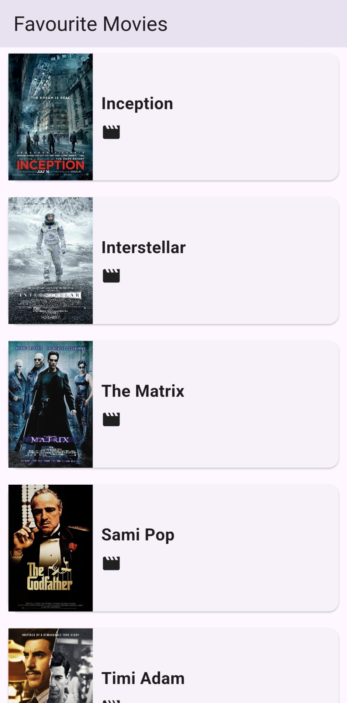

# Favourite Movies

A simple Flutter app to browse a list of favorite movies.

## What it contains

- Project structure: `lib/models`, `lib/screens`, `lib/widgets`, `lib/data`, `lib/common`
- Sample movie data in `lib/data/movies.dart`
- UI strings centralized in `lib/common/strings.dart`

## Run

1. flutter pub get
2. flutter run

This README was enhanced to follow project submission checklist guidance (app title, short description, and where to place screenshots).

## Screenshots

